# PillPal

  

## Table of Contents

1. [Project Overview](#project-overview)
2. [System Features](#system-features)
3. [Database Procedures](#database-procedures)
4. [Database Schema](#database-schema)
5. [Sample Data](#sample-data)
6. [Gallery](#gallery)
7. [Authors](#authors)

---

## Project Overview

Our goal is to create a comprehensive system for managing medications, prescriptions, and patient data. This project aims to streamline interactions between patients, doctors, and pharmacists by providing a web platform for easy management of treatment information.

---

## System Features

* **Authentication and Login**
  Users can log in using individual accounts.

* **Patient Data Management**
  Patients can register, view their personal information, and access their prescription history.

* **Prescription Issuance**
  Doctors can issue prescriptions for patients, specifying required medications and dosages.

* **Medication Inventory**
  Pharmacists can add and update available medications in their pharmacy, including quantity and price.

* **Pharmacy Management**
  Stores pharmacy information such as name, location (city, street, number), and medication inventory.

* **Prescription Status Tracking**
  Patients can track prescription status (fulfilled or pending) at the pharmacy.

---

## Database Procedures

* **Prescription Management**
  PL/SQL procedures for adding, updating, and deleting prescriptions and their medications.

* **Inventory Management**
  PL/SQL procedures for adding and updating medication stock levels in pharmacies.

* **Data Security**
  PL/SQL functions for data validation, generating unique prescription codes, and verifying unique national IDs (PESEL).

---

## Database Schema

**ERD Diagram**

  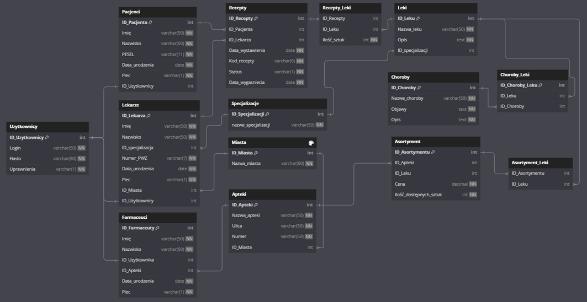

---

## Sample Data

* **Patient**
  Login: `piotr`
  Password: `zaq1@WSX`

* **Doctor**
  Login: `doctor1`, `doctor2`, … `doctor9`
  Password: `zaq1@WSX`

* **Pharmacist**
  Login: `pharm1`, `pharm2`, `pharm3`
  Password: `zaq1@WSX`

* **Database User**
  Login: `hr`
  Password: `oracle`

---

## Gallery

### Home Page

  

---

### Login Screens

<table>
  <tr>
    <td align="center">
      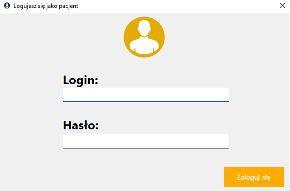 Patient Login
    </td>
    <td align="center">
      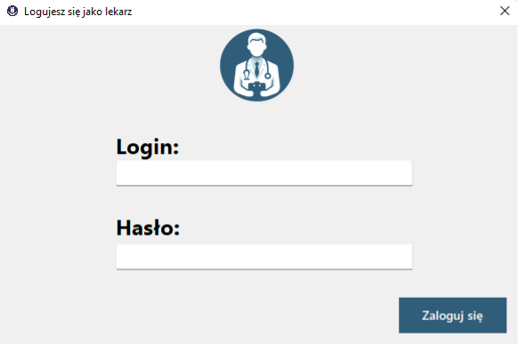 Doctor Login
    </td>
  </tr>
  <tr>
    <td colspan="2" align="center">
      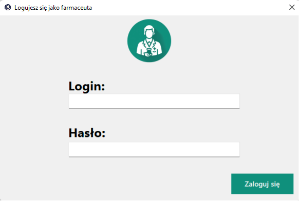 Pharmacist Login
    </td>
  </tr>
</table>

---

### Patient Views

<table>
  <tr>
    <td align="center">
      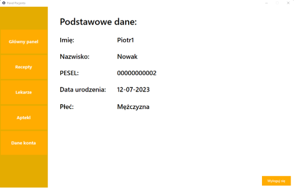 Patient Dashboard
    </td>
    <td align="center">
      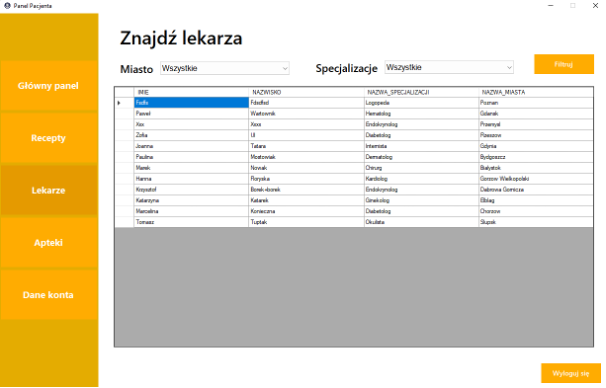 Patient Medications
    </td>
  </tr>
  <tr>
    <td align="center">
      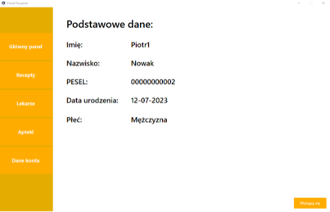 Edit Patient Details
    </td>
    <td align="center">
      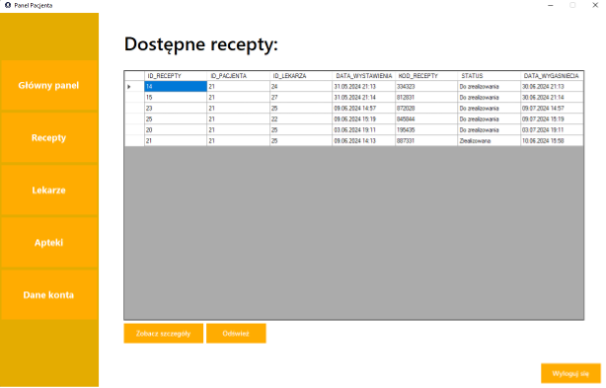 Patient Prescriptions
    </td>
  </tr>
</table>

---

### Doctor Views

<table>
  <tr>
    <td align="center">
      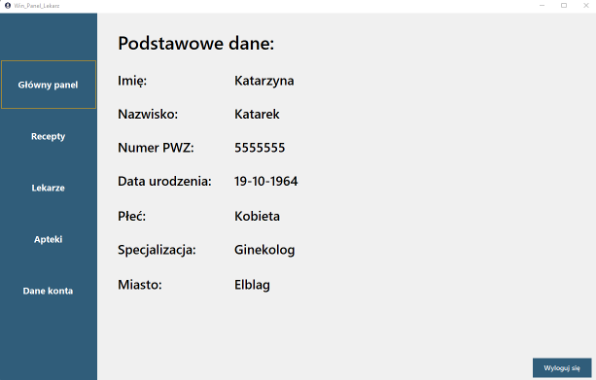 Doctor Dashboard
    </td>
    <td align="center">
      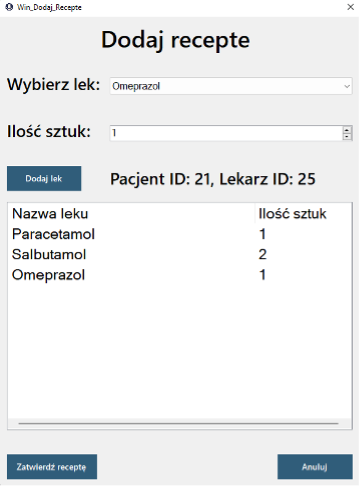 Doctor Prescriptions
    </td>
  </tr>
  <tr>
    <td colspan="2" align="center">
      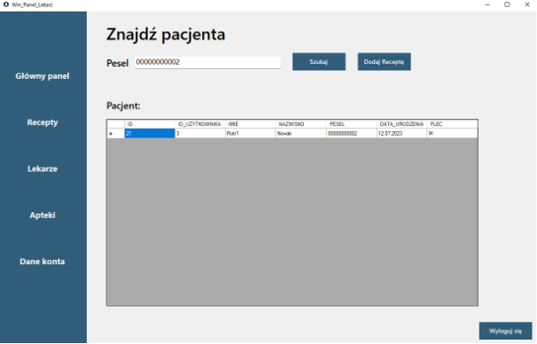 Doctor’s Patients
    </td>
  </tr>
</table>

---

### Pharmacist Views

<table>
  <tr>
    <td align="center">
      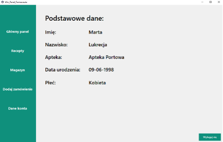 Pharmacist Dashboard
    </td>
    <td align="center">
      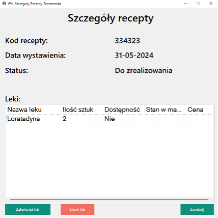 Prescription Details
    </td>
  </tr>
  <tr>
    <td align="center">
      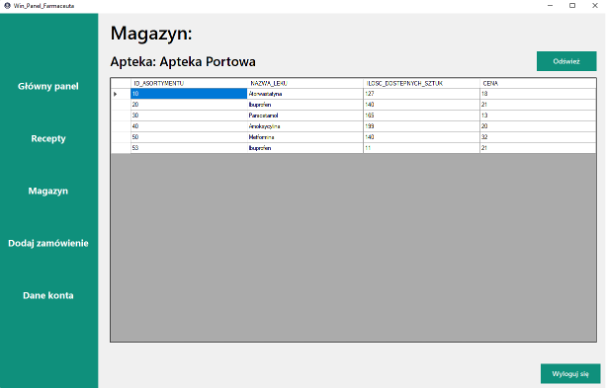 Pharmacy Inventory
    </td>
    <td align="center">
      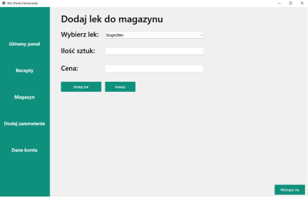 Inventory Stock
    </td>
  </tr>
  <tr>
    <td colspan="2" align="center">
      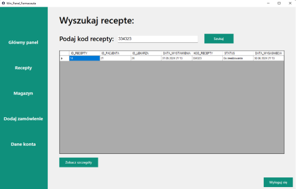 Pharmacy Prescriptions
    </td>
  </tr>
</table>

## Authors

* Piotr Nowak ([GitHub](https://github.com/Puegoo))
