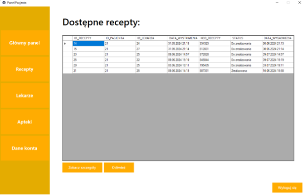

<h1 align="center">PillPal</h1>

  

## Spis treści
1. [Opis założeń projektu](#opis-założeń-projektu)
2. [Funkcje systemu](#funkcje-systemu)
3. [Funkcje bazy danych](#funkcje-bazy-danych)
4. [Baza danych](#baza-danych)
5. [Przykładowe dane](#przykładowe-dane)
6. [Galeria](#galeria)
7. [Autorzy](#autorzy)

---

## Opis założeń projektu

Naszym celem jest stworzenie kompleksowego systemu wspierającego zarządzanie lekami, receptami oraz danymi pacjentów. Projekt ten ma na celu ułatwienie interakcji między pacjentami, lekarzami i farmaceutami, poprzez stworzenie internetowej platformy, która umożliwi łatwe zarządzanie informacjami dotyczącymi leczenia.

---

## Funkcje systemu

- **Logowanie i uwierzytelnianie**  
  Funkcja ta umożliwia użytkownikom logowanie się do systemu poprzez indywidualne konta.

- **Zarządzanie danymi pacjentów**  
  Pacjenci mogą zarejestrować się w systemie, przeglądać swoje dane osobowe oraz historię recept.

- **Wystawianie recept**  
  Lekarze mogą wystawiać recepty dla pacjentów, określając potrzebne leki oraz ich ilość.

- **Zarządzanie lekami**  
  Farmaceuci mogą dodawać informacje o dostępnych lekach w swojej aptece, wraz z ich ilością i ceną.

- **Zarządzanie aptekami**  
  Informacje o aptekach, takie jak nazwa, lokalizacja (miasto, ulica, numer) oraz asortyment leków, są przechowywane w systemie.

- **Śledzenie statusu recept**  
  Pacjenci mogą śledzić status swoich recept — czy są zrealizowane lub oczekują na realizację w aptece.

---

## Funkcje bazy danych

- **Zarządzanie receptami**  
  Procedury PL/SQL do dodawania, aktualizowania i usuwania recept oraz leków na receptach.

- **Zarządzanie asortymentem**  
  Procedury PL/SQL do dodawania i aktualizowania stanu magazynowego leków w aptekach.

- **Bezpieczeństwo**  
  Funkcje PL/SQL do walidacji danych, generowania unikalnych kodów recept oraz sprawdzania unikalności PESEL.

---

## Baza danych

**Diagram ERD**  

  

---

## Przykładowe dane

- **Pacjent**  
  Login: `piotr`  
  Hasło: `zaq1@WSX`

- **Lekarz**  
  Login: `lekarz1` (od 1 do 9)  
  Hasło: `zaq1@WSX`

- **Farmaceuta**  
  Login: `farm1` (także 2, 3)  
  Hasło: `zaq1@WSX`

- **Baza danych**  
  Login: `hr`  
  Hasło: `oracle`

---

## Galeria

### Strona główna

  

---

### Logowanie

<table>
  <tr>
    <td align="center">
       Logowanie pacjenta
    </td>
    <td align="center">
       Logowanie lekarza
    </td>
  </tr>
  <tr>
    <td colspan="2" align="center">
       Logowanie farmaceuty
    </td>
  </tr>
</table>

---

### Pacjent

<table>
  <tr>
    <td align="center">
       Panel pacjenta
    </td>
    <td align="center">
       Leki pacjenta
    </td>
  </tr>
  <tr>
    <td align="center">
       Edycja danych
    </td>
    <td align="center">
       Recepty pacjenta
    </td>
  </tr>
</table>

---

### Lekarz

<table>
  <tr>
    <td align="center">
       Panel lekarza
    </td>
    <td align="center">
       Recepty lekarza
    </td>
  </tr>
  <tr>
    <td colspan="2" align="center">
       Pacjenci lekarza
    </td>
  </tr>
</table>

---

### Farmaceuta

<table>
  <tr>
    <td align="center">
       Panel farmaceuty
    </td>
    <td align="center">
       Szczegóły recepty
    </td>
  </tr>
  <tr>
    <td align="center">
       Asortyment apteki
    </td>
    <td align="center">
       Magazyn apteki
    </td>
  </tr>
  <tr>
    <td colspan="2" align="center">
       Recepty w aptece
    </td>
  </tr>
</table>

## Autorzy

- Piotr Nowak ([GitHub](https://github.com/Puegoo))
